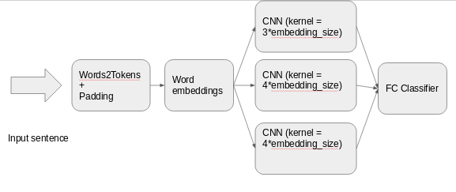

# CNN for language identification
##  Motivation: 
Modify the baseline architecture so that we can use a CNN for the language detection in order to reduce the inference time while keeping similar results as LSTM.

## Schema:
Instead of applying a recursive network we will format the embeddings in a 1d array of shape: [b_size, embedding_size*#words]. This way we are able to apply 1d convolutions of the text with kernel_size= 3*embedding size (else we would be slicing our filters inside the same word embedding)

The schema of the network are 3 convolution layers with 512 filters of different kernel_sizes that when combined provide different resolution context features (3 words, 4 words, 5 words) which is forwarded to the final classicator (fully connected layer).

 

  

